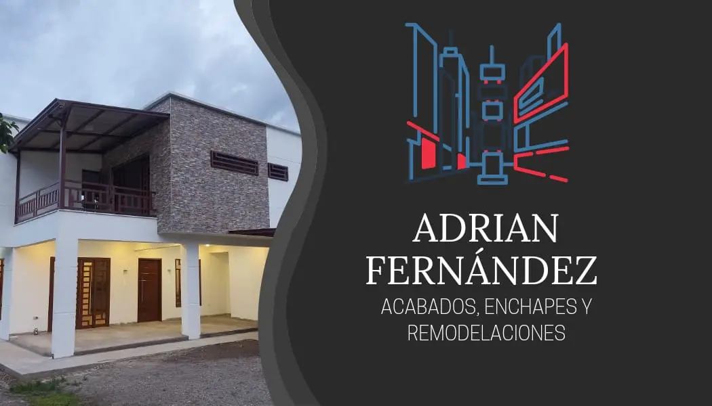

<h1 align="center">Acabados Adrian fernandez</h1>

  

## Tabla de Contenido
- [Descripción](#descripción)
- [Lenguajes de Programación Utilizados](#lenguajes-de-programación-utilizados)
- [Contribuciones](#contribuciones)
- [Contacto](#contacto)

## Descripción
### Descripción de la Página Web

Bienvenido a la página web de Adrián Fernández, un emprendedor apasionado por la remodelación de apartamentos en Bogotá, Colombia. Con un enfoque en la calidad y la satisfacción del cliente, Adrián ofrece servicios de remodelación personalizados que transforman espacios de vida en hogares soñados.

### Características Principales de la Página

1. **Página de Inicio**: Una breve presentacion de la imagen del proyecto.

2. **Servicios**: Una vista dinámica con una cuadrícula de 3x3 que muestra proyectos recientes. Cada tarjeta de proyecto revela una breve descripción al pasar el cursor, y al hacer clic, despliega un modal con detalles completos del proyecto, detalles de los servicios ofrecidos, desde diseño de interiores hasta renovaciones completas, todo con un enfoque en la excelencia y la atención al detalle. 

3. **Contacto**: Un formulario interactivo que permite a los clientes potenciales ponerse en contacto directamente con Adrián para consultas y cotizaciones.

4. **Navbar y Footer Estáticos**: Navegación fácil y accesible en todo momento, con enlaces a las principales secciones del sitio y un eslogan inspirador que refleja la misión de Adrián.

### Valor Añadido

Esta página web está diseñada para ser una experiencia de usuario fluida y atractiva, destacando la profesionalidad y el compromiso de Adrián Fernández con la excelencia en cada proyecto de remodelación. Visítanos y descubre cómo podemos transformar tu apartamento en el hogar de tus sueños.

## Lenguajes de Programación Utilizados
- HTML
- CSS
- JavaScript

## Contribuciones
Para contribuciones al proyecto hacer un clon del repositorio, hacer modificaciones y luego hacer pull request.

## Contacto
Puedes encontrarme en:

- [LinkedIn](www.linkedin.com/in/adrian-fernandez-606a21248)
- [GitHub](https://github.com/adferatuz)
